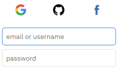

T-Regx recommended way of installation is using <a href="https://packagist.org/packages/rawr/t-regx" target="_blank">Composer</a>.

## PHP 7.1 and later

The installation of T-Regx is really simple - just add a composer dependency:
```bash
composer require rawr/t-regx
```

[Scroll to "How to install Composer"](#install-composer)

## Try T-Regx online (repl.it)

Before you install, you can try T-Regx online, right in your browser. 

Just visit [T-Regx on repl.it], and when it boots up (after about 4 seconds), just click "Run" at the top.

[](https://repl.it/github/T-Regx/fiddle)

You can log in to [repl.it] with GitHub account, Google account, Facebook account or regular credentials.

[](https://repl.it/github/T-Regx/fiddle)

There are two files in the fiddle: You can edit `EDIT_HERE.php` as you please; 
`EXAMPLES.php` contains many basic and complicated examples of T-Regx.

Go to [repl.it] and run the `EXAMPLES.php` or your file in `EDIT_HERE.php`:

[](https://repl.it/github/T-Regx/fiddle)

## Install composer

You can either download an executable setup from [https://getcomposer.org/download/], or use a 
script to download it, right from your terminal (Windows and Unix).

```bash
php -r "copy('https://getcomposer.org/installer', 'composer-setup.php');"
php composer-setup.php
php -r "unlink('composer-setup.php');"
```

Once downloaded, install T-Regx.

```bash
php composer.phar require rawr/t-regx
```

[https://getcomposer.org/download/]: https://getcomposer.org/download/
[T-Regx on repl.it]: https://repl.it/github/T-Regx/fiddle
[T-Regx fiddle]: https://repl.it/github/T-Regx/fiddle
[repl.it]: https://repl.it/github/T-Regx/fiddle
[repl.it]: https://repl.it/github/T-Regx/fiddle
